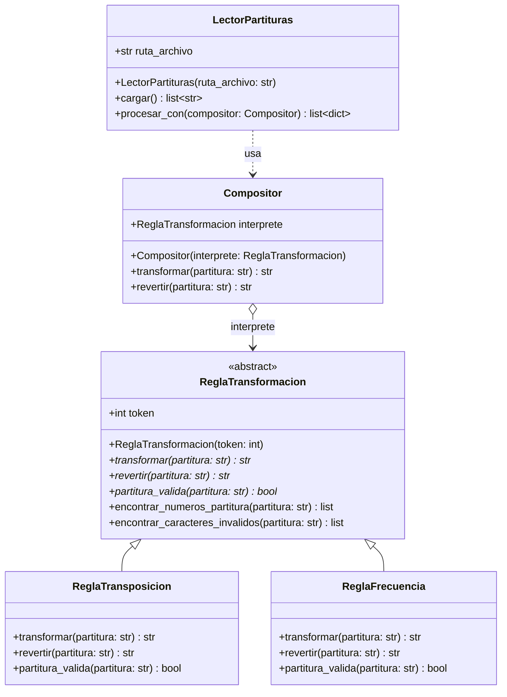
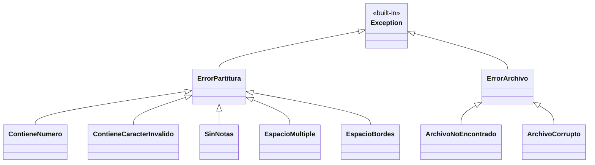

# Ejercicio Procesador de Partituras Musicales

Has sido contratado por una compañía de tecnología musical que diseña instrumentos electrónicos
inteligentes. El equipo necesita un componente de software capaz de **transformar** y **revertir**
partituras escritas en notación de solfeo (do, re, mi, fa, sol, la, si).

Como ejercicio inicial para demostrar tu dominio de la programación orientada a objetos, debes
implementar un componente que aplique dos reglas distintas de transformación sobre partituras,
llamadas **Transformación por Transposición** y **Transformación por Frecuencia**.

---

## Parte 1 — Implementación del modelo

### 1. Transformación por Transposición

Esta regla de transformación tiene las siguientes restricciones:

* La partitura **no puede contener números**.
* La partitura debe consistir **únicamente** de:
  * notas válidas del solfeo: `do`, `re`, `mi`, `fa`, `sol`, `la`, `si`,
  * el separador de compás `|`,
  * el silencio `-`,
  * y espacios para separar los tokens.
* Cualquier carácter no ASCII (por ejemplo, letras con tildes como `dó`) es inválido.
* Antes de realizar la transformación, toda la partitura debe llevarse a **minúscula**.
* La partitura **no puede consistir únicamente** de separadores y silencios (`|`, `-`); debe
  contener al menos una nota.

La transformación consiste en que, con un `token` dado, se debe reemplazar cada nota por la nota
que se encuentra `n = token` posiciones más adelante en el alfabeto musical
`[do, re, mi, fa, sol, la, si]`. El alfabeto se considera **circular**, de modo que después de
`si` vuelve a iniciar en `do`. Los separadores `|` y los silencios `-` se mantienen sin cambio.

**Revertir** consiste en realizar el paso contrario: tomar cada nota y moverse hacia atrás `n = token`
posiciones para encontrar cuál era la nota original.

### 2. Transformación por Frecuencia

Esta regla de transformación tiene las siguientes restricciones:

* La partitura **no puede contener números**.
* La partitura puede contener espacios, pero **máximo 1 espacio entre cada nota** y **no puede
  haber espacios al inicio o al final**.
* Antes de realizar la transformación, toda la partitura debe llevarse a **minúscula**.
* Solo se permiten notas válidas (`do`, `re`, `mi`, `fa`, `sol`, `la`, `si`); no se permiten
  separadores ni silencios bajo esta regla.

La transformación consiste en que, por cada nota en la partitura, se obtiene su **frecuencia base
en Hz** y se multiplica por el valor del `token`. Cada valor resultante se guarda en una cadena,
separado por un espacio.

Tabla de frecuencias base (en Hz):

| Nota | Frecuencia |
|------|------------|
| do   | 261        |
| re   | 293        |
| mi   | 329        |
| fa   | 349        |
| sol  | 392        |
| la   | 440        |
| si   | 493        |

**Revertir** consiste simplemente en, por cada valor numérico, dividirlo por el `token`,
luego buscar a qué nota corresponde la frecuencia obtenida y volver a formar la partitura.

---

### Diagrama de clases



### Jerarquía de errores



### ¿Dónde va cada cosa? (archivos a implementar)

El proyecto ya tiene los archivos creados, pero su contenido está vacío. Debes implementar
cada clase exactamente en el archivo indicado a continuación:

| Archivo | Clases que debes implementar aquí |
|---------|-----------------------------------|
| `partituras/modelo/compositor.py` | `ReglaTransformacion` (abstracta), `ReglaTransposicion`, `ReglaFrecuencia`, `Compositor` |
| `partituras/modelo/errores.py`    | `ErrorPartitura`, `ContieneNumero`, `ContieneCaracterInvalido`, `SinNotas`, `EspacioMultiple`, `EspacioBordes`, `ErrorArchivo`, `ArchivoNoEncontrado`, `ArchivoCorrupto` |
| `partituras/modelo/lector.py`     | `LectorPartituras` |
| `main.py`                         | Código de orquestación (instanciar compositores y `LectorPartituras`, imprimir resultados, manejar errores). No define clases nuevas. |

> No cambies los nombres de los archivos ni la ruta del paquete: las pruebas dependen de
> importar desde `partituras.modelo.compositor`, `partituras.modelo.errores` y
> `partituras.modelo.lector`.

Dentro de `compositor.py` puedes importar las clases de error que necesites con, por ejemplo:

```python
from partituras.modelo.errores import (
    ContieneNumero,
    ContieneCaracterInvalido,
    SinNotas,
    EspacioMultiple,
    EspacioBordes,
)
```

Y dentro de `lector.py` puedes importar lo que necesites de `compositor.py` y `errores.py`:

```python
from partituras.modelo.compositor import Compositor
from partituras.modelo.errores import (
    ArchivoNoEncontrado,
    ArchivoCorrupto,
    ErrorPartitura,
)
```

### Indicaciones para la implementación

Tu misión es implementar el modelo planteado en el diagrama anterior. Para lograrlo, ten en
cuenta lo siguiente:

* La clase `ReglaTransformacion` es una clase abstracta (usar `ABC` del módulo `abc`) y sus
  métodos `transformar`, `revertir` y `partitura_valida` son igualmente abstractos.
* La clase `ReglaTransformacion` recibe en su constructor un valor numérico que será asignado a
  una variable de instancia llamada `token`.
* El método `encontrar_numeros_partitura` de la clase `ReglaTransformacion` implementa la lógica
  para regresar una lista con las posiciones (y caracteres) donde se encuentre un dígito en la
  partitura recibida como parámetro. Se sugiere resolverlo con una **list comprehension**.
* El método `encontrar_caracteres_invalidos` de la clase `ReglaTransformacion` implementa la
  lógica para regresar una lista con las posiciones donde se encuentren caracteres que no
  pertenezcan al código ASCII (por ejemplo, letras con tildes como `dó`, `é`).
* Las clases `ReglaTransposicion` y `ReglaFrecuencia` implementan `partitura_valida` con la
  lógica que verifica las restricciones descritas arriba. Si alguna restricción no se cumple,
  debe levantarse el error correspondiente según la jerarquía de errores.
* Si el error es por contenido (la partitura tiene números o caracteres no permitidos), el
  constructor del error debe recibir un mensaje detallando **en qué posición** se encuentra
  cada carácter problemático y **cuál es el carácter en específico**, por orden de aparición.
* Si existe **más de un tipo de error** en una misma partitura, debes levantar un
  [`ExceptionGroup`](https://docs.python.org/es/3/tutorial/errors.html#raising-and-handling-multiple-unrelated-exceptions)
  que contenga todos los errores aplicables.
* Los métodos `transformar` y `revertir` de `ReglaTransposicion` y `ReglaFrecuencia` deben:
  1. Verificar primero que la partitura sea válida.
  2. Llevar toda la partitura a minúscula.
  3. Aplicar la lógica correspondiente a la regla.
  Se recomienda usar **list comprehensions** para procesar las notas en bloque.
* Los métodos `transformar` y `revertir` de la clase `Compositor` deben retornar el resultado
  de invocar el método correspondiente sobre el objeto `interprete` que tienen como atributo.
* De ser necesario, puedes agregar métodos auxiliares en cualquier clase para facilitar el
  desarrollo.

### Lectura desde archivo: clase `LectorPartituras`

> **Archivo en el que debes implementarla:** `partituras/modelo/lector.py`

Como parte del modelo, también debes implementar la clase `LectorPartituras`. Esta clase
**se integra con `Compositor`**: lee las partituras de un archivo JSON y las procesa en lote
a través de cualquier `Compositor`.

#### Contrato de la clase

* `__init__(self, ruta_archivo: str)`: guarda la ruta del archivo en `self.ruta_archivo`.
* `cargar(self) -> list[str]`: abre el archivo, lo parsea como JSON y retorna la lista de
  partituras que se encuentra bajo la llave `"partituras"`. Debe manejar correctamente:
  * `FileNotFoundError` → relanzar como `ArchivoNoEncontrado` con un mensaje útil.
  * `json.JSONDecodeError` → relanzar como `ArchivoCorrupto` con un mensaje útil.
  * El uso de `raise ... from e` (encadenamiento de excepciones) es obligatorio.
* `procesar_con(self, compositor: Compositor) -> list[dict]`: invoca `cargar()` y luego, para
  cada partitura, intenta `transformar` y `revertir`. Debe retornar una lista de diccionarios
  con la siguiente forma:
  ```python
  {
      "original":    "do re mi",        # str, la partitura tal como viene del archivo
      "transformada": "la si do",       # str | None — None si hubo error
      "revertida":    "do re mi",       # str | None — None si hubo error
      "exito":        True,             # bool
      "errores":      [],               # list[str] — vacía si exito=True
  }
  ```
  Cada error de validación capturado debe convertirse a una cadena descriptiva dentro de
  `errores` (recuerda que el modelo puede levantar un `ExceptionGroup` con varios errores
  simultáneos: tu lista de errores debe incluirlos a todos).
  Se requiere que la construcción de la lista de resultados se haga con una
  **list comprehension**.

#### Archivo de ejemplo

El proyecto incluye `partituras_ejemplo.json` con partituras que pasan y no pasan las
restricciones. Puedes modificarlo o crear uno propio.

#### `main.py`

> **Archivo en el que debes implementar la orquestación:** `main.py` (en la raíz del proyecto).

En `main.py` debes:

1. Crear un `Compositor` con `ReglaTransposicion` y otro con `ReglaFrecuencia`, con el
   `token` que prefieras.
2. Crear un `LectorPartituras` apuntando a `partituras_ejemplo.json`.
3. Llamar a `procesar_con` para cada compositor.
4. Imprimir por pantalla, para cada partitura: la original, el resultado de la transformación,
   el resultado de revertirla y, en caso de error, los mensajes de error capturados.
5. Manejar `ArchivoNoEncontrado` y `ArchivoCorrupto` con un bloque `try/except` que muestre
   un mensaje claro al usuario (no dejar que el programa termine con un traceback).

---

## Parte 2 — Diseño propio

Una vez termines la Parte 1, deberás **diseñar tú mismo** las siguientes clases (no se entrega
diagrama; tú decides el diseño y luego justifícalo en un comentario al inicio de cada archivo).

### Archivos que debes crear en la Parte 2

Crea un nuevo paquete `partituras/diseno/` (con su `__init__.py` vacío) y coloca cada clase en
su propio archivo:

| Archivo | Clase |
|---------|-------|
| `partituras/diseno/__init__.py` | (vacío) |
| `partituras/diseno/regla_extra.py` | La nueva regla que diseñes (ej. `ReglaRetrogradacion`, `ReglaInversionMelodica`) |
| `partituras/diseno/biblioteca.py` | `BibliotecaPartituras` |
| `partituras/diseno/historial.py` | `RegistroHistorial` |

### 2.1. Una nueva regla de transformación

Crea una nueva clase que herede de `ReglaTransformacion` con una regla original. Algunas ideas:

* `ReglaRetrogradacion`: invierte el orden de las notas (las primeras pasan a ser las últimas).
  Útil para el llamado *cangrejo* en composición.
* `ReglaInversionMelodica`: refleja la melodía sobre una nota pivote (la nota pivote queda
  igual; las que están `k` posiciones arriba quedan `k` posiciones abajo).
* Cualquier otra regla que se te ocurra, siempre y cuando respete el contrato de la clase
  abstracta y tenga restricciones de validación claras.

### 2.2. Una clase `BibliotecaPartituras`

Diseña una clase que represente una biblioteca persistente de partituras. Como mínimo, debe:

* Permitir **agregar** una partitura con un nombre (por ejemplo, *"Sonata en Do menor"*).
* Permitir **buscar** partituras por nombre o por contenido.
* Permitir **guardar** y **cargar** el estado desde un archivo en disco
  (sugerido: JSON, manejando `FileNotFoundError` y `json.JSONDecodeError`).
* Ofrecer una operación que use **comprehensions** sobre la colección, por ejemplo: listar todas
  las partituras que contengan una nota específica, o filtrar las que tengan más de N notas.

### 2.3. Una clase `RegistroHistorial`

Diseña una clase que registre cada transformación que se ejecuta. Como mínimo, debe:

* Guardar para cada entrada: timestamp, nombre de la regla, token, partitura original y
  resultado (o mensaje de error si falló).
* Permitir **exportar** el historial a un archivo de texto o JSON.
* Tener al menos un método que resuelva una pregunta no trivial mediante **comprehensions**,
  por ejemplo: "¿cuáles fueron las 5 reglas con más errores en la última hora?".

Recuerda crear los archivos en las rutas indicadas en la tabla del inicio de la Parte 2.

---

## Configuración del proyecto en PyCharm

Este proyecto está pensado para ser desarrollado con **PyCharm**. Sigue estos pasos:

### 1. Hacer fork y clonar el repositorio

El profesor compartirá el enlace al repositorio en GitHub. **No clones el repo del profesor
directamente**; primero haz un fork para tener tu propia copia donde puedas hacer commits.

1. Abre el enlace del repositorio en tu navegador, ingresando con tu cuenta de GitHub.
2. Haz clic en el botón **Fork** (esquina superior derecha) → *Create fork*. Esto crea una
   copia del proyecto bajo tu usuario.
3. En **tu fork** (no en el del profesor), haz clic en el botón verde **Code** y copia la
   URL HTTPS (o SSH si ya tienes llaves configuradas).
4. Clona tu fork. Tienes dos opciones:

   **Opción A — clonar directamente desde PyCharm (recomendado):**
   1. Abre PyCharm.
   2. En la pantalla de bienvenida, selecciona `Get from VCS` (o `File` → `New` →
      `Project from Version Control...` si ya tienes otro proyecto abierto).
   3. Pega la URL de tu fork en el campo *URL*.
   4. Elige la carpeta donde quieres guardar el proyecto y haz clic en `Clone`.
   5. Cuando PyCharm te pregunte si confías en el proyecto, selecciona *Trust Project*.

   **Opción B — clonar desde la terminal y luego abrir en PyCharm:**
   ```bash
   git clone <url-de-tu-fork>
   cd procesador_partituras
   ```
   Después abre PyCharm → `File` → `Open...` → selecciona la carpeta clonada → *Trust Project*.

### 2. Crear el entorno virtual (virtualenv)

PyCharm crea el entorno automáticamente:

1. Ve a `PyCharm` → `Settings...` (en macOS) o `File` → `Settings...` (en Windows/Linux).
2. En el panel izquierdo: `Project: procesador_partituras` → `Python Interpreter`.
3. Haz clic en el engranaje ⚙ → `Add Interpreter` → `Add Local Interpreter...`.
4. Selecciona `Virtualenv Environment` → `New environment`.
5. Verifica que la ruta sea `<ruta-del-proyecto>/venv` y que el Base interpreter sea
   Python 3.10 o superior.
6. Haz clic en `OK`.

PyCharm activará el entorno automáticamente cada vez que abras una terminal interna del proyecto.

### 3. Instalar dependencias

Desde la terminal integrada de PyCharm (`View` → `Tool Windows` → `Terminal`):

```bash
pip install -r requirements.txt
```

> Si prefieres hacerlo desde la consola de tu sistema, primero activa el entorno virtual:
> * **macOS / Linux:** `source venv/bin/activate`
> * **Windows (PowerShell):** `venv\Scripts\Activate.ps1`
>
> Si en Windows aparece un error de permisos, ejecuta:
> `Set-ExecutionPolicy -ExecutionPolicy RemoteSigned -Scope CurrentUser`

### 4. Ejecutar las pruebas en PyCharm

Hay tres formas de ejecutar las pruebas; cualquiera funciona:

**Opción A — desde el panel de proyecto:**
1. Haz clic derecho sobre la carpeta `tests` (panel izquierdo).
2. Selecciona `Run 'pytest in tests'`.

**Opción B — sobre un archivo o función específica:**
1. Abre `tests/test_compositor.py`.
2. Haz clic en el ▶ verde que aparece junto al nombre de una función de prueba o de la
   clase para ejecutarla individualmente.

**Opción C — desde la terminal integrada:**
```bash
pytest
# o con más detalle:
pytest -v
# para una prueba específica:
pytest tests/test_compositor.py::test_transformar_transposicion -v
```

> **Importante:** la primera vez que ejecutes una prueba en PyCharm, abre
> `Run` → `Edit Configurations...`, en la sección *Templates* → *Python tests* → *pytest*,
> verifica que el *Working directory* sea la raíz del proyecto. Esto asegura que las
> importaciones `from partituras...` funcionen.

### 5. Ejecutar `main.py`

Una vez implementada la Parte 1:

* Haz clic derecho sobre `main.py` → `Run 'main'`.
* O desde la terminal: `python main.py`.

---

## Ten en cuenta

* El proyecto incluye un conjunto de pruebas en `tests/test_compositor.py` que puedes usar
  para verificar el cumplimiento de los requisitos de la **Parte 1**. Para ejecutarlas necesitas
  instalar `pytest` (incluido en `requirements.txt`).
* Para que las pruebas funcionen correctamente, debes implementar el código **respetando los
  nombres** y la definición de las clases y los métodos descritos en el diagrama.
* La evaluación se hará con base en el cumplimiento de los requisitos verificados por las
  pruebas. Cualquier nombre mal escrito o que no concuerde con el modelo dado se considerará
  como un requisito no cumplido.
* Para la **Parte 2**, la evaluación se basará en la calidad del diseño: uso correcto de
  herencia y abstracción, manejo de errores, uso de comprehensions y separación de
  responsabilidades.
